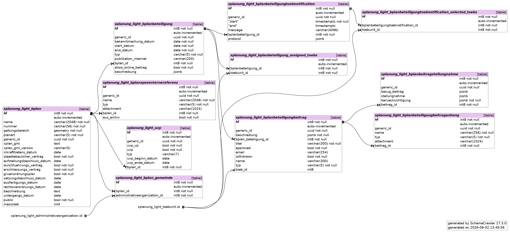

===========
Entwicklung
===========

`Github Repo`_

   .. _Github Repo: https://github.com/mrmap-community/xplanung_light/

===========
Datenmodell
===========

*****************************
Grundmodell am Beispiel BPlan
*****************************

===========
Hilfsmittel
===========

****************
Regressionstests
****************

.. code-block:: shell

   python manage.py test

*************
Testabdeckung
*************

.. code-block:: shell

   pip install coverage
   # Laufen lassen
   coverage run --source='.' manage.py test
   # Ausgabe shell
   coverage report
   # Generierung HTML-Variante
   coverage html

*********************
Django Security Check
*********************

.. code-block:: shell

   python manage.py check --deploy

****************************************************
Überprüfung von Abhängigkeiten auf Sicherheitslücken
****************************************************

.. code-block:: shell

   pip install pip-audit
   pip-audit

**********************************************
Statische Code-Analyse auf Sicherheitsprobleme
**********************************************

.. code-block:: shell

   pip install bandit
   bandit -r . -x ./venv
