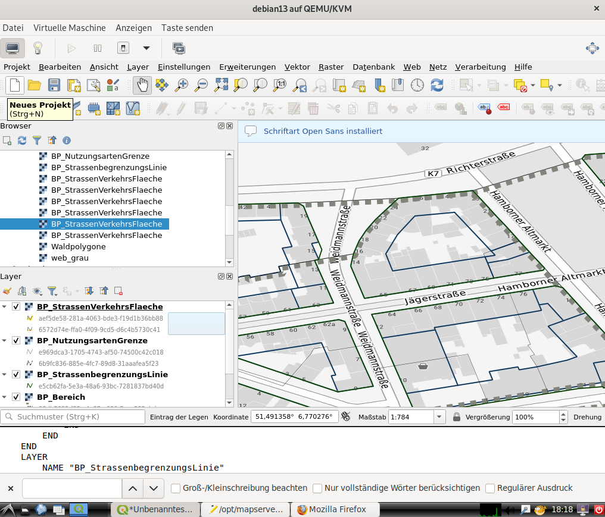

==========================
Diskussion / Offene Punkte
==========================

------------------------------------
Rendering der vollvektoriellen Pläne
------------------------------------

Hintergrundinformationen
^^^^^^^^^^^^^^^^^^^^^^^^

Aktuell werden vollvektorielle Pläne nicht visualisiert. Um diese Pläne halbwegs ordentlich
darstellen zu können, muss man eine einheitliche Zeichenvorschrift haben.
Diese liegt derzeit nicht vor. 

Im XPlanBox-Projekt gibt es SE-Dateien, die vom Deegree-Server genutzt werden, um die
Zeichenvorschrift abzubilden: 
https://gitlab.opencode.de/diplanung/ozgxplanung/-/tree/main/xplan-webservices/xplan-webservices-workspaces/src/main/workspace/styles/xplansyn/default?ref_type=heads

Das QGIS-Plugin XPlanReader benutzt hierzu qml-Files:
https://github.com/kreis-viersen/xplan-reader/tree/main/styles

Das ist alles noch **WIP**.

In der GDI-DE-Registry findet sich ein Verzeichnis mit SLD-Dateien aus dem Jahr 2024:
https://repository.gdi-de.org/style/de.xleitstelle.xplanung/

Auch diese stellen nur einen kleinen Teil der benötigten standardisierten Styles zur Verfügung.

Umsetzung mit mapserver
^^^^^^^^^^^^^^^^^^^^^^^

Konfiguration
"""""""""""""
Im optimalen Fall kann man die GML-Dateien direkt mit einer Rendering-Engine visualisieren.
Bei XPlanung-light bietet sich hierzu die Nutzung des integrierten Mapserver an.
Ab der Version 8.2 kann man in den mapfiles Pfade zu SLD-Dateien und Symbolen angeben. 
Der Mapserver löst die Infomationen auf und wendet die Styles direkt auf die jeweiligen Layer an.

Beispielplan: https://opendata-duisburg.de/sites/default/files/780%20Alt-Hamborn.gml

Lokale Ablage der SLDs aus der GDI-DE-Registry

.. code-block:: shell
    
   wget -r https://repository.gdi-de.org/style/de.xleitstelle.xplanung/

.. note::

   Auszug aus einem mapfile mit SLD-Referenz:

   .. code-block:: cfg

      #
      LAYER
        NAME "BP_StrassenVerkehrsFlaeche"
        TYPE POLYGON
        CONNECTIONTYPE OGR
        CONNECTION "/opt/mapserver/data/780_Alt-Hamborn.gml"
        DATA "BP_StrassenVerkehrsFlaeche"
        METADATA
            WMS_TITLE       "BP_StrassenVerkehrsFlaeche"
            WMS_SRS         "EPSG:25832"
            WMS_ABSTRACT    "Testpolygon"
            "wms_extent"    "344972.646 5706529.6654 345513.2002 5706833.653"
        END
        VALIDATION
            "sld_external_graphic" "^/opt/mapserver/data/repository.gdi-de.org/style/de.xleitstelle.xplanung/svg/home/user/mapserver/symbols/[a-zA-Z0-9_\-\.]+\.(png|jpg|svg)$"
        END
        PROJECTION
            "init=epsg:25832"
        END
	    STYLEITEM "sld:///opt/mapserver/data/repository.gdi-de.org/style/de.xleitstelle.xplanung/index.sld"
        CLASS
            NAME "BP_StrassenVerkehrsFlaeche"
            STYLE
                OUTLINECOLOR 0 255 0 
                WIDTH 2 
            END 
        END
    END
    #

Darstellung des Mapserver WMS in QGIS
"""""""""""""""""""""""""""""""""""""

Varianten
"""""""""

* Transformation der xml-Files aus dem XPlanBox-Projekt oder aus den qml-Files des XPlan-Reader nach SLD - Nutzung von **Geostyler-cli**: https://github.com/geostyler/geostyler-cli
* Definition eigener Styles für die jeweiligen Layer - das sind sehr viele ;-)
