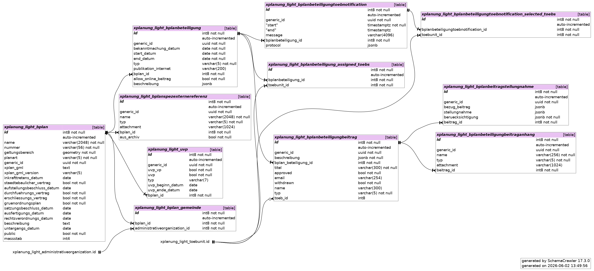
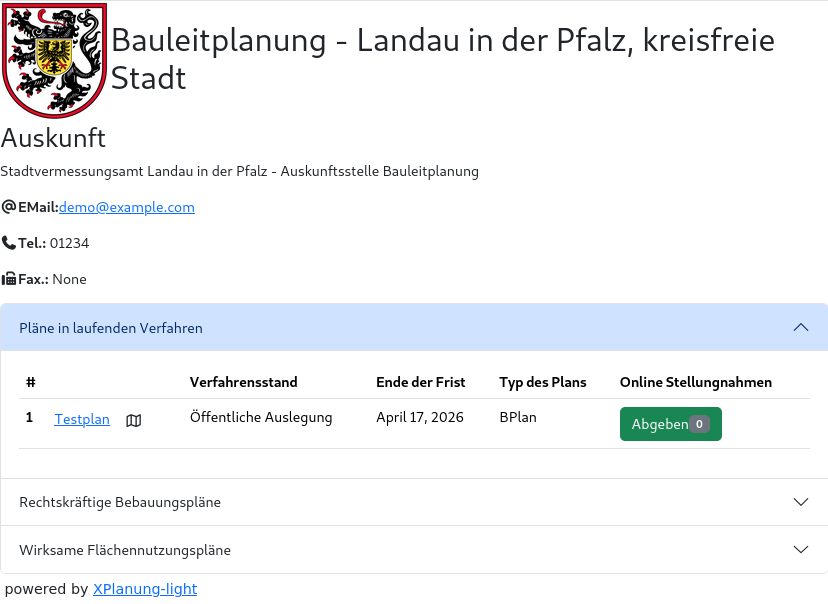
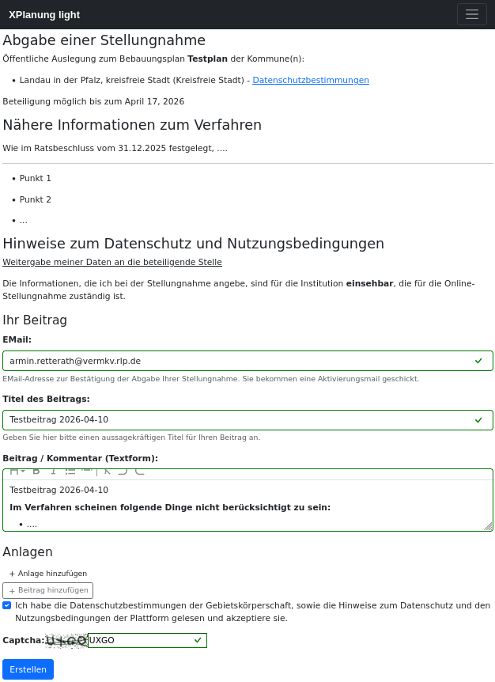
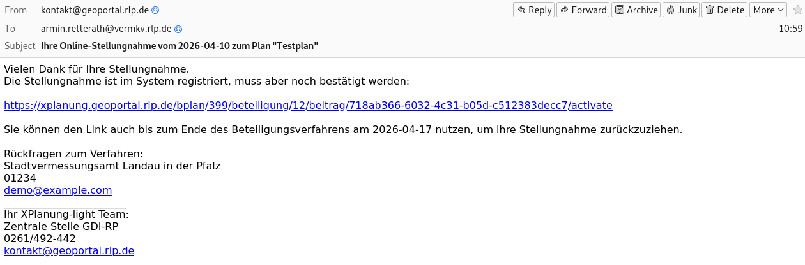
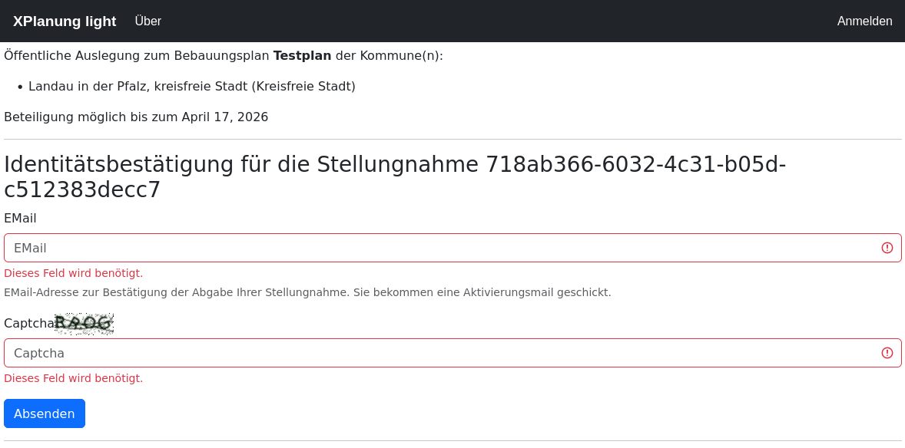
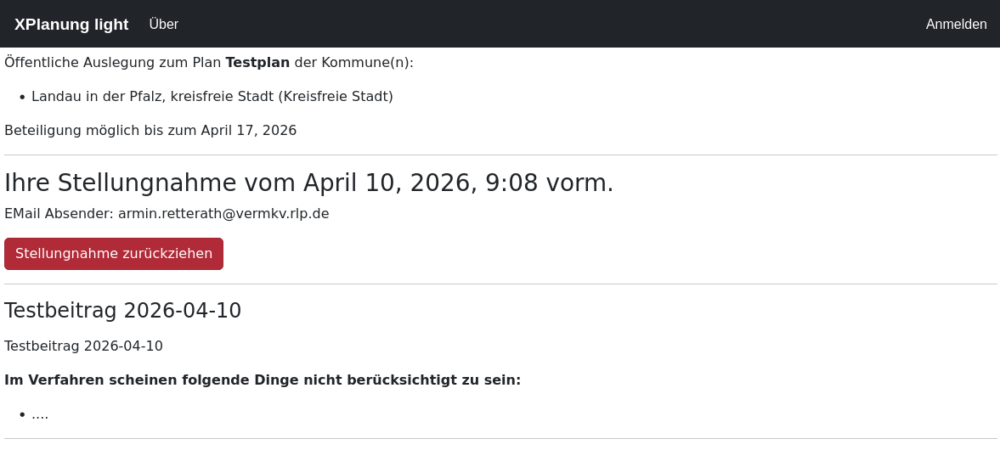
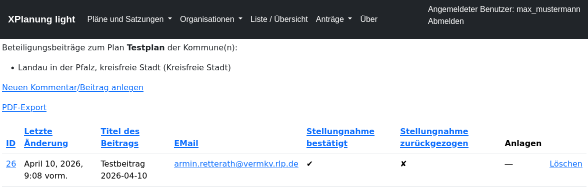
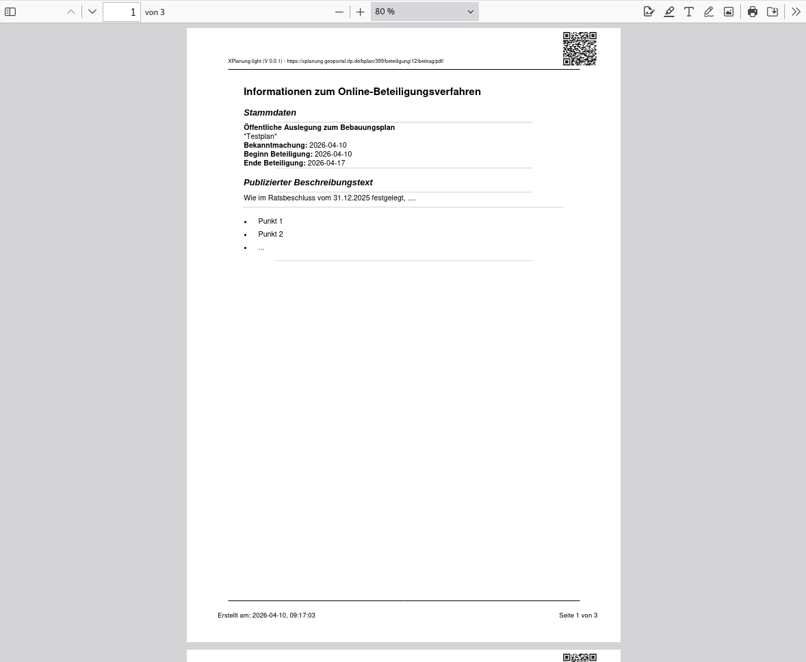
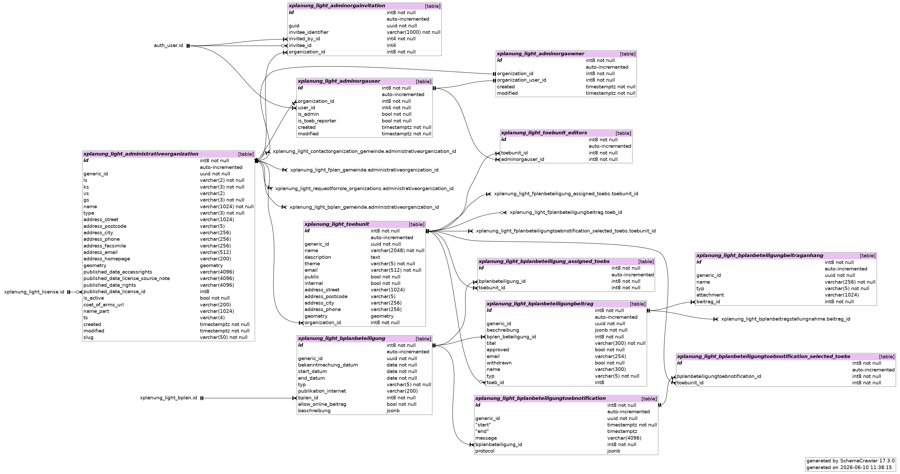

#############
Beteiligungen
#############

Mit XPlanung-light lassen sich bliebig viele Beteiligungsverfahren verwalten. 

XPlanung sieht hier aktuell nur zwei verschiedene Typen vor, die in Form von Datumswerten dokumentiert werden:

* ``xplan:auslegungsStartDatum``, ``xplan:auslegungsEndDatum``
* ``xplan:traegerbeteiligungsStartDatum``, ``xplan:traegerbeteiligungsEndDatum``

Da dies nicht ausreichend ist, um Beteiligungsverfahren abbilden zu können, nutzt XPlanung-light ein eigenes Datenmodell.

*****************************
Beteiligungsverfahren anlegen
*****************************

Zur Beteiligungsverwaltung kommt man über **Pläne und Satzungen ->  Bebauungspläne**. Link in der Spalte **Beteiligungen**. 

Formular zur Erfassung eines Beteiligungsverfahrens

.. image:: ../media/bplan_beteiligung_anlegen.png

Liste der Beteiligungsverfahren

.. image:: ../media/bplan_beteiligung_liste.png

*************************************
Online Stellungnahme (Öffentlichkeit)
*************************************

Auf der Auskunftsseite der Gebietskörperschaft werden die aktuell laufenden Beteiligungsverfahren aufgelistet.
Ist die Online-Stellungnahme aktiviert, kann bekommt der Nutzer dies angezeigt und ein Formular angeboten.

=======================================
Online-Auskunft der Gebietskörperschaft
=======================================

=====================================
Formular für Abgabe der Stellungnahme
=====================================

Hier können neben eines Titels und einer Beschreibung auch bis zu vier Anlagen beigefügt werden.

=================
Aktivierungsmail
=================

Zur Sicherheit, muss der Stellungnehmende die Abgabe seiner Stellungnahme über einen Aktivierungslink bestätigen. 

================================
Zurückziehen einer Stellungnahme
================================

Der Stellungnehmende kann seine Stellungnahme während des laufenden Beteiligungsverfahrens jederzeit zurückziehen.
Hierzu nutzt er den Link aus der Aktivierungsmail. Falls die Session abgelaufen ist, muss er sich jedoch durch Angabe seiner 
EMail-Adresse erneut authentifizieren.

========================
Liste der Stellungnahmen
========================

Der Bearbeiter hat eine Übersicht über die abgegebenen Stellungnahmen.

================================
Report zum Beteiligungsverfahren
================================

Man kann einen PDF-Report für die Akten generieren lassen.

****************
TOEB-Beteiligung
****************

Neben der Online-Öffentlichkeitsbeteiligung lassen sich auch TOEB-Beteiligungen (Trägerbeteiligungen) abbilden. 

Bei der Trägerbeteiligung entscheidet die jeweilige Gebietskörperschaft darüber, welche Institution beteiligt werden soll.
In der Regel sind das Behörden, NGOs oder aber auch andere Gebietskörperschaften und ggf. sogar Vereine. Zum aktuellen Zeitpunkt 
nutzen die meisten Kommunen Excel-Tabellen zur Pflege der zu beteiligenden Organisationen. Kontaktinformationen werden also **hochgradig
redundant** verwaltet. Es gibt selten einheitliche Vorgaben wie beispielsweise in Hessen (`Anlage zum Erlass über TOEB-Beteiligung`_).

Die verwendeten Listen haben i.d.R. einen Umfang von 40 - 120 Kontaktstellen und gliedern sich nach thematischen und räumlichen 
Zuständigkeiten. Je nach Verfahren entscheidet der Träger darüber welche der Stellen angeschrieben werden. Die Benachrichtigung der Träger
erfolgt in fast allen Fällen per E-Mail. 

==================
Modellierung TOEBs
==================

Die TOEBs sind - wie auch die Gebietskörperschaften - Objekte der Klasse AdministrativeOrganization. Es gibt zusätzlich ein ToebUnit Modell, dass die jeweiligen
Kontaktstellen abbildet. TOEB-Kontaktstellen haben sowohl eigene fachliche und räumliche Zuständigkeiten als auch eine eindeutige Zuordnung zu 
einem fachlichen Thema. Eine TOEB-Kontaktstelle kann mehrere Sachbearbeiter haben. Die Sachbearbeiter sind Nutzer des Systems mit der
Rolle **TOEB-Reporter**. Da sich die Rolle auf die **Organisation** TOEB bezieht, kann ein Sachbearbeiter Beiträge für verschiedene Kontaktstellen (sogar organisationsübergreifend)
anlegen und verwalten. 

... **WIP** ...

.. _Anlage zum Erlass über TOEB-Beteiligung: https://bauleitplanung.hessen.de/sites/bauleitplanung.hessen.de/files/2022-06/verzeichnis_der_traeger_oeffentlicher_belange_hessen_0.pdf