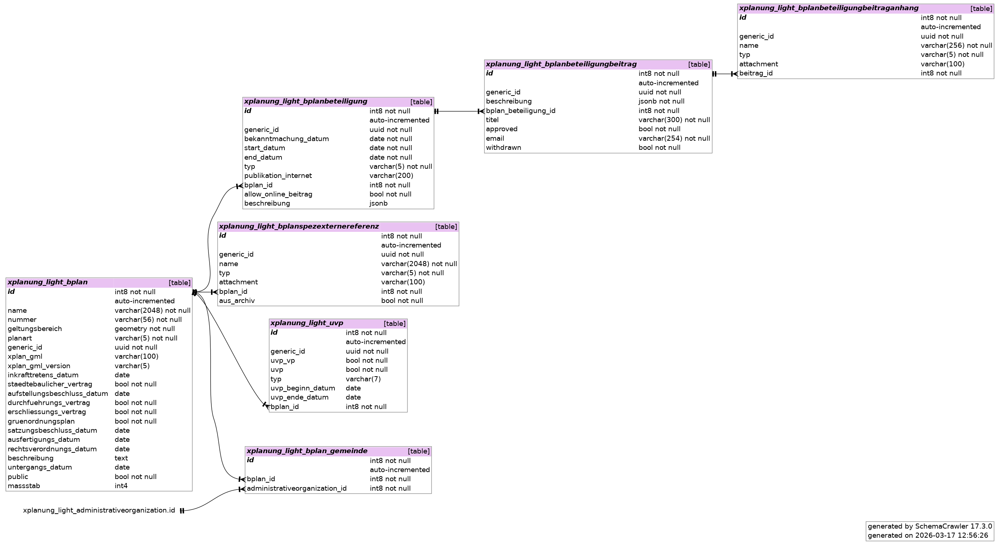
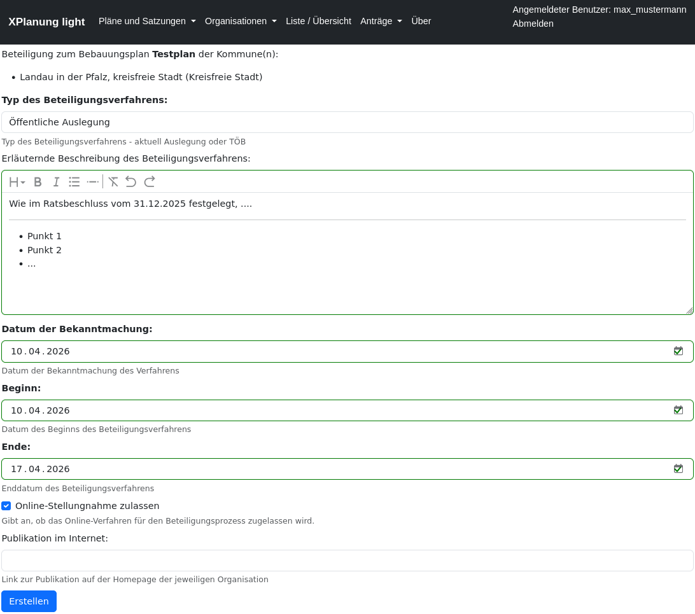
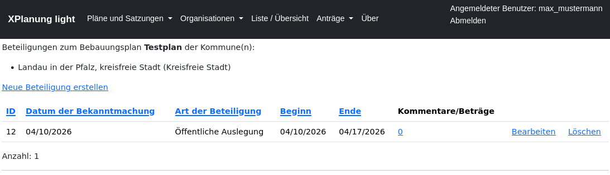

#############
Beteiligungen
#############

Mit XPlanung-light lassen sich bliebig viele Beteiligungsverfahren verwalten. 

XPlanung sieht hier aktuell nur zwei verschiedene Typen vor, die in Form von Datumswerten dokumentiert werden:

* ``xplan:auslegungsStartDatum``, ``xplan:auslegungsEndDatum``
* ``xplan:traegerbeteiligungsStartDatum``, ``xplan:traegerbeteiligungsEndDatum``

Da dies nicht ausreichend ist, um Beteiligungsverfahren abbilden zu können, nutzt XPlanung-light ein eigenes relationales Datenmodell.

*****************************
Beteiligungsverfahren anlegen
*****************************

Zur Beteiligungsverwaltung kommt man über **Pläne und Satzungen ->  Bebauungspläne**. Link in der Spalte **Beteiligungen**. 

Formular zur Erfassung eines Beteiligungsverfahrens

Liste der Beteiligungsverfahren

===========
Heading 3
===========

Heading 4
************

Heading 5
===========

Heading 6
~~~~~~~~~~~

