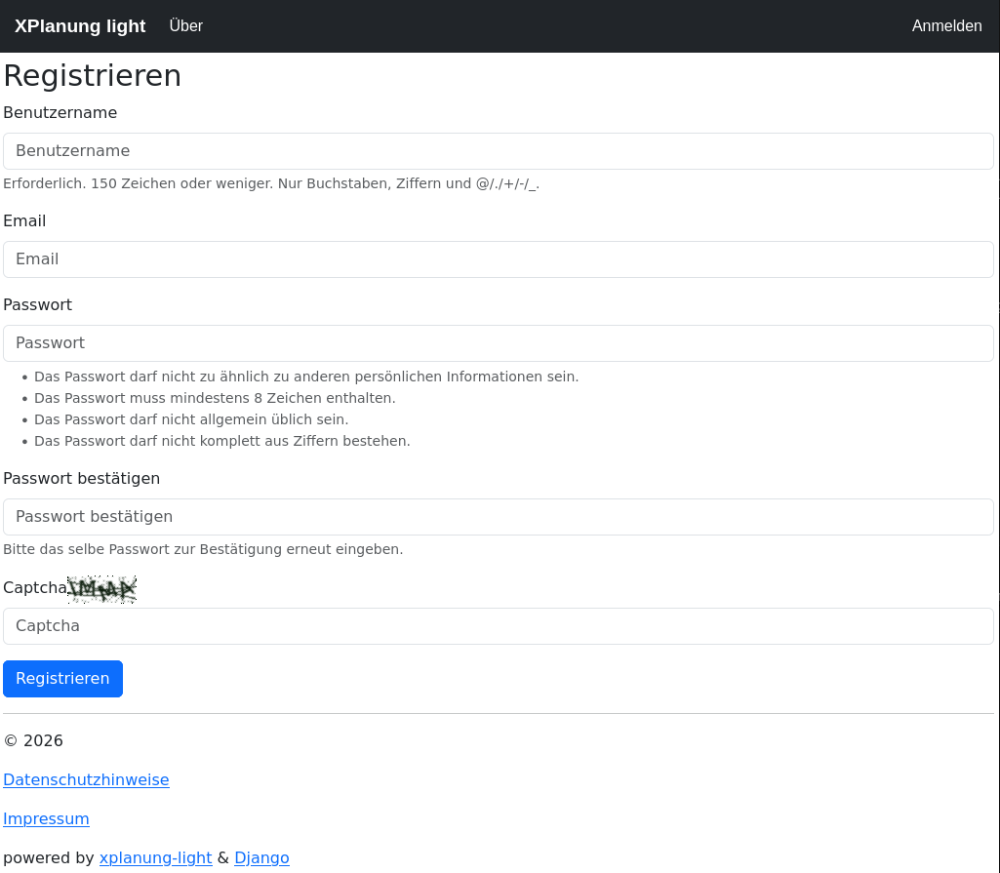
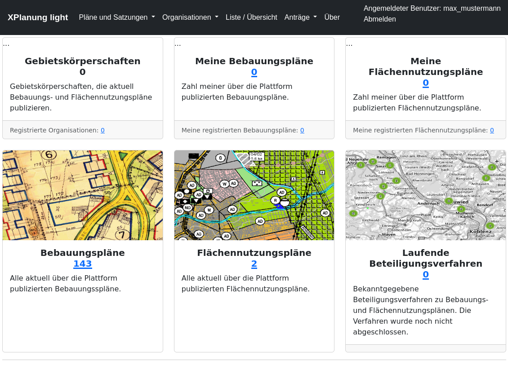
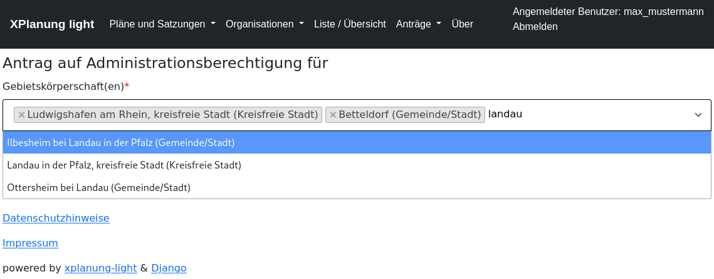
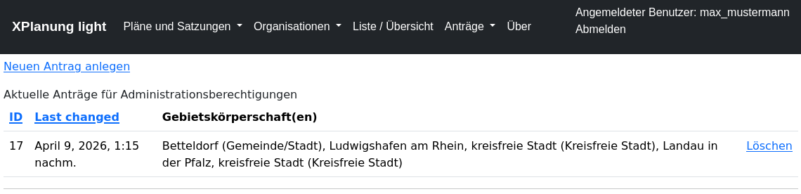

################
Nutzerverwaltung
################

*************
Einleitung
*************
Für die Verwaltung der Nutzer wird das Django Standardnutzermodell verwendet. 
Es werden nur minimale Informationen benötigt und die Nutzer können sich selbst registrieren.

Attribute für einen Nutzer:

* Benutzername - frei wählbar im Rahmen der technischen Vorgaben (keine Leerzeichen erlaubt)
* EMail
* Password - frei wählbar im Rahmen der technischen Vorgaben (Minimallänge, nicht allgemein üblich , ...)

*************
Registrierung
*************

*************
Dashboard
*************
Nach der erfolgreichen Registrierung ist der Nutzer direkt angemeldet. Er hat dann ein erweitertes Dashboard zur Verfügung und 
kann Anträge stellen.

**************************************
Administrationsberechtigung
**************************************
Um Bauleitpläne für Gebietskörperschaften verwalten zu können, muss diese Funktion durch den Zentraladministrator freigeschaltet werden.
Hierzu stellt der Nutzer einen einfachen Online-Antrag. Im Formular kann aus der vorgegebenen Liste der Gebietskörperschaften ausgewählt werden.

=============
Online-Antrag
=============

=================
Liste der Anträge
=================

=================
Freigabe
=================
Die Anträge werden durch den Zentraladministrator geprüft und ggf. nach Rücksprache freigegeben. Bei Freigabe oder Zurückweisung erhält der Nutzer
eine EMail. Die Anträge und Entscheidungen über die Anträge werden in der Datenbank dokumentiert. 

Nach der Freigabe kann der Nutzer Bauleitpläne der ihm zugeordneten Gebietskörperschaften verwalten. 
**Die Berechtigung hängt an der Gebietskörperschaft und nicht am Account des Nutzers**.
