##############
Planverwaltung
##############

*************
Pläne anlegen
*************
Die Informationen zu den Bauleitplänen lassen sich auf verschiedene Arten in das System überführen. Sollten die Pläne in maschinenlesbaren Formaten vorliegen, 
ist ein programmatischer Import die beste Lösung. Ein Beispielscript befindet sich im management Ordner.

=============
Über Formular
=============
.. role:: red
   :class: red

Aufruf des Formulars über den Menupunkt **Pläne und Satzungen ->  Bebauungspläne**. Link **BPlan_anlegen**.

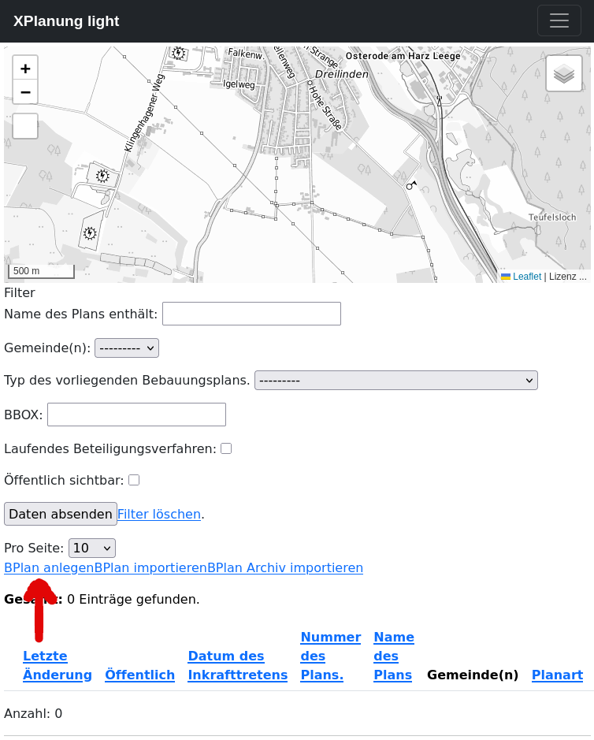

Formular mit Pflichtfeldern (markiert durch roten ``*`` )
************************************************************

XPlanung selbst sieht **nur vier Pflichtfelder** vor:

* Name
* Gemeinde(n)
* Geltungsbereich (Multipolygon)
* Typ des Plans

Für XPlanung-light haben wir **Nummer** als zusätzliches Pflichtfeld deklariert. 
Die optionalen Felder sind im unteren Bereich des Formulars aufgeführt.

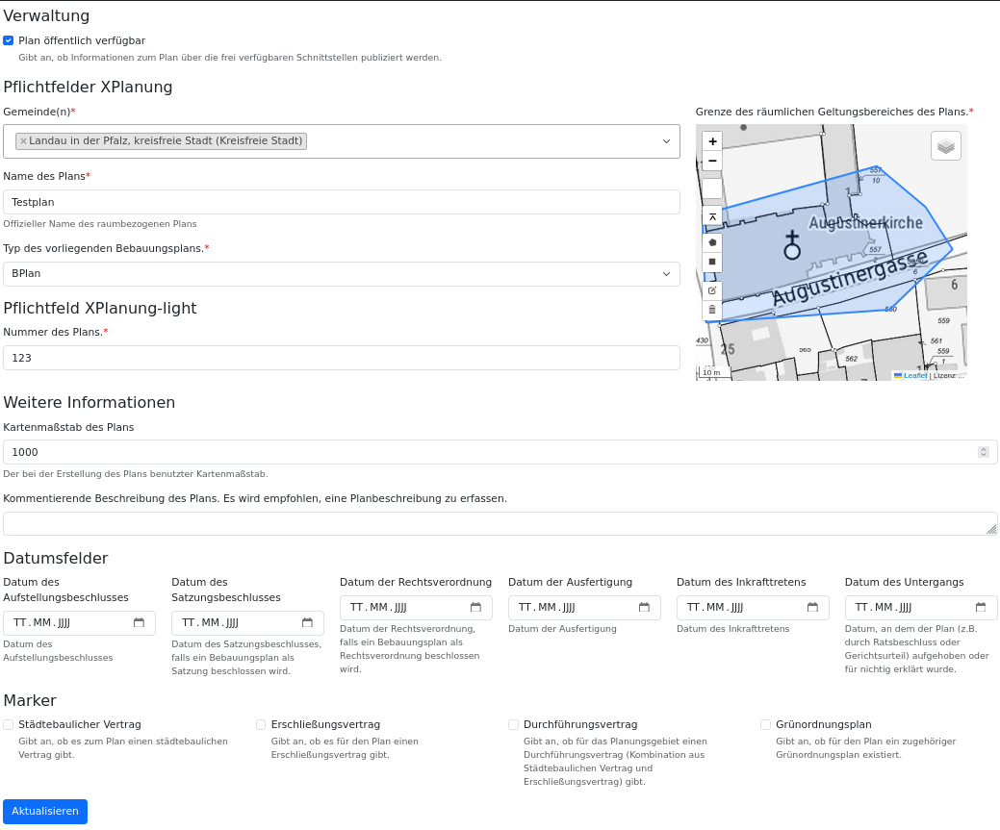

Nach Absenden des Formulars wird man zur Liste zurückgeleitet. Dort wird der neu erfasste Record angezeigt. Die Umringsgeometrie ist im 
Kartenviewer zu sehen und der Plan lässt sich hierüber auch selektieren. Es stehen diverse Filter zur Verfügung.

Besonderheiten
==============

* Es können mehrere Gebietskörperschaften zugewiesen werden
* Der Geometrieeditor erlaubt auch das Hochladen von KML/GPX und GeoJSON (vorhandene Geometrien werden ersetzt)
* Die Validierung der Datumsfelder (zeitliche Abfolge) erfolgt durch das Überschreiben der clean Funktion im BPlan-Model

Liste der eigenen Bebauungspläne
********************************

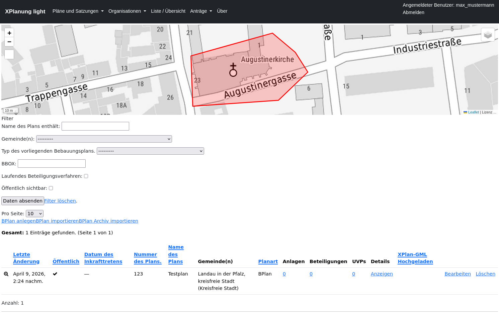

Detailanzeige
*************
In der Detailanzeige erhält man eine Übersicht über den kompletten Datensatz. Wichtig ist hier, dass viele Informationen 
dynamisch erstellt werden. Die Informationen zu den Kontaktstellen und den verantwortlichen Organisationen werden direkt
genutzt und müssen nicht doppelt gepflegt werden. 

Es werden auch Links auf verschiedene Schnittstellen angeboten:

* Export des XPlan-GML
* Export des XPlan-Archiv (ZIP)
* Dynamisch generierte ISO19139 Metadaten

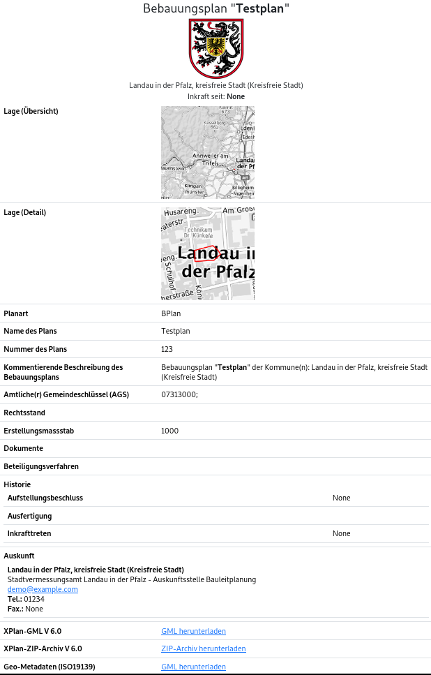

================
Upload XPlan-GML
================

Aufruf des Formulars über den Menupunkt **Pläne und Satzungen ->  Bebauungspläne**. Link **BPlan_importieren**.

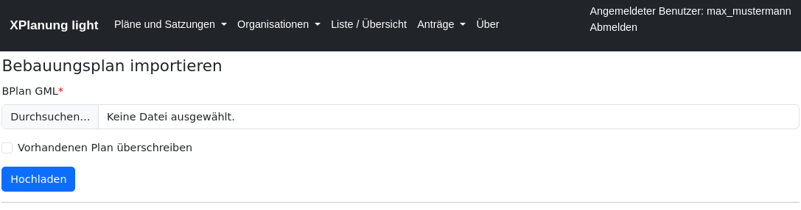

Folgende Prüfungen werden durchgeführt:

* Unterstützte XPlan Versionen: 5.1, 5.4, 6.0
* ``xplan:XP_Gemeinde`` muss **ags** und **gemeindeName** beinhalten
* In der Organisationsregistry **muss** eine Organisation mit dem gleichen **ags** und **gemeindeName** existieren
* Der Nutzer muss die Berechtigung besitzen, die Pläne für diese Organisation zu verwalten

.. note::

   Die Identität der Pläne wird durch eine Kombination von **XP_Gemeinde** und dem Namen des Plans gewährleistet. Der Name des Plans (**xplan:name**) muss also innerhalb einer 
   Gemeinde **eindeutig** sein.

   Ist der Plan schon vorhanden, so muss explizit ausgewählt werden, dass dieser überschrieben werden soll.

   Wurde eine XPlan-GML Datei von einem Planungsbüro geliefert, kann diese mit einem Editor geöffnet werden und man kann das **XP_Gemeinde**
   Objekt mit der Hand abändern. Am besten gibt man aber den Büros die Werte für **ags** und **gemeindeName** vor.

Beispiel
********

Export eines Plans in XPlan-GML und anschliessender Import.

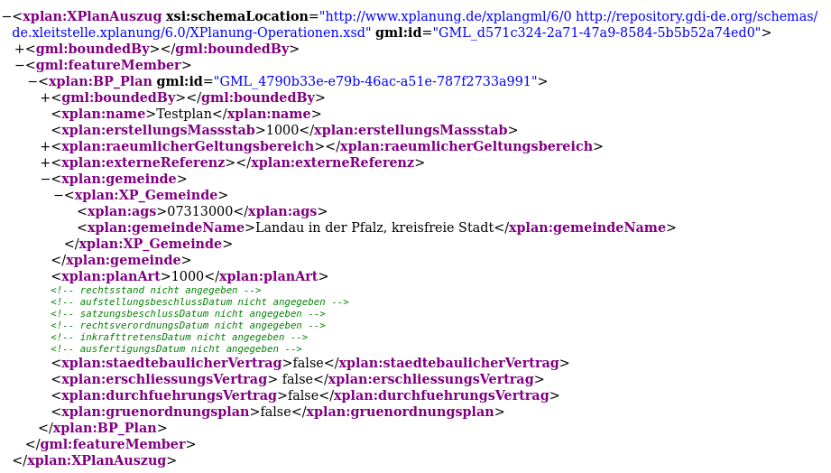

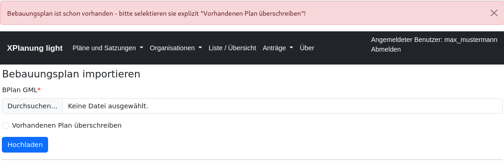

===================
Upload XPlan-Archiv
===================

Aufruf des Formulars über den Menupunkt **Pläne und Satzungen ->  Bebauungspläne**. Link **BPlan_Archiv_importieren**.

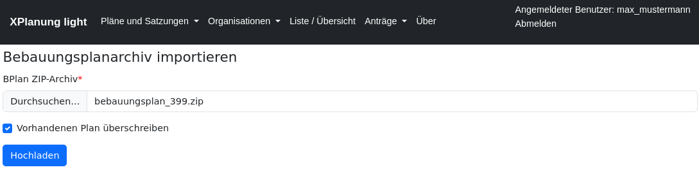

Nach dem erfolgreichen Import wird im Record dokumentiert, dass der Plan aus einem XPlan-GML stammt. 

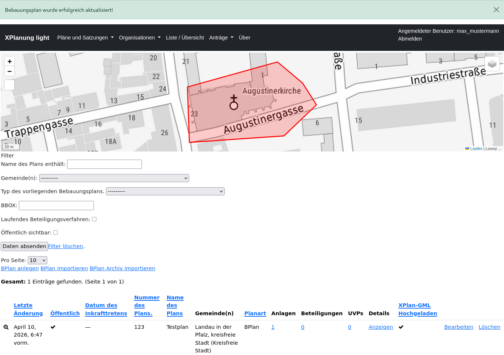

Die Anlagen werden ebenfalls importiert. 

.. note::

    Da hier keine Identitätsprüfung auf Dateibasis erfolgt, werden vorhandene Anlagen mit gleichem **Namen** immer überschrieben. Gleichnamige vorhandene Dateien erhalten einen neuen Dateinamen. 

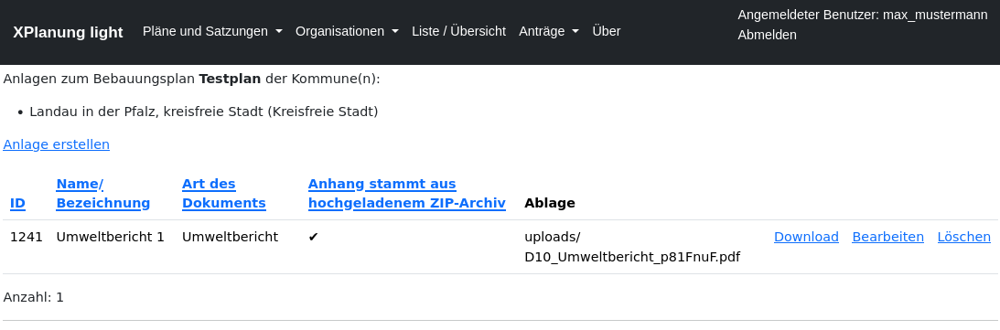

*****************
Anlagen verwalten
*****************
Mit XPlanung-light können lassen sich bliebig viele Anlagen verwalten. XPlanung gibt eine Liste von Dokumententypen vor: ``XP_ExterneReferenzTyp``. 
Diese ist leider nicht ausreichend und muss für die Praxis ergänzt werden. Zur Anlagenverwaltung kommt man über **Pläne und Satzungen ->  Bebauungspläne**. Link in der Spalte **Anlagen**. 

Liste der Anlagen

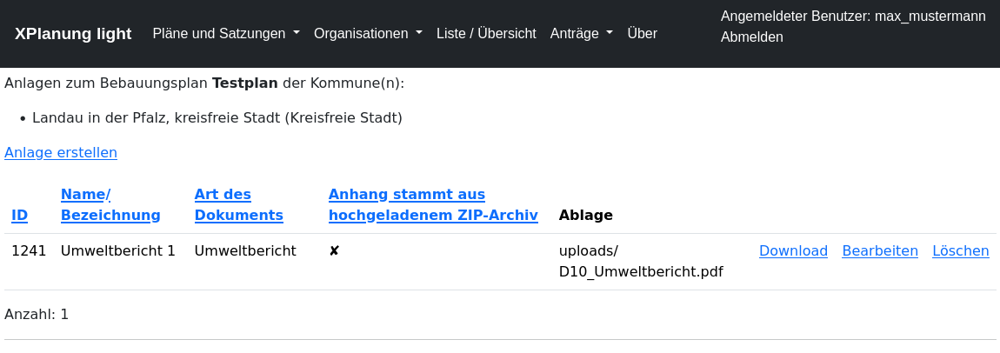

Zulässige Dateitypen:

* TBD

Maximale Dateigröße: TBD MB

Vor dem Upload wird die Datei auf Viren überprüft!

.. note::

   Will man eine Anlage vom Typ **Karte** hochladen, wird diese speziell validiert. Diese Anlage wird später genutzt, um das
   das Bild über die WebMapService-Schnittstelle an der richtigen Stelle darstellen zu können.

   Folgende Eigenschaften werden gefordert:

   * Format: geotiff
   * CRS: EPSG:25832
   * Overviews vorhanden
   * LZW Komprimierung

========================
Anlagen in Detailanzeige
========================

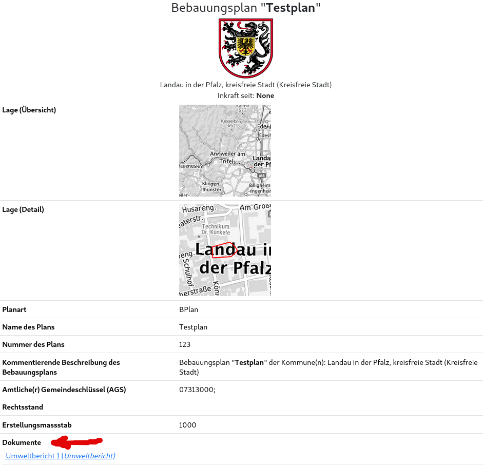

=======================
Anlagen in XPlan-Archiv
=======================

Alle Anlagen werden beim Export des XPlan-Archivs mit in die ZIP-Datei geschrieben.

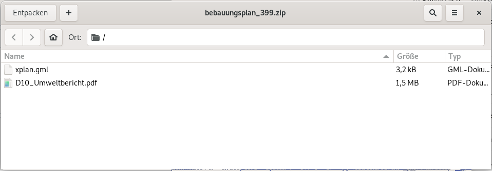

Die Referenzen im XPlan-GML werden automatisch gesetzt.

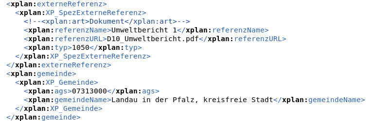

************
XPlan Export
************

Beim Export der XPlan Informationen muss unterschieden werden, ob das Objekt im System erstellt oder über die XPlan-GML Schnittstelle importiert wurde.
Ein mit XPlanung-light erstellter Plan enthält nur die Informationen, die das XPlanung-light Informationsmodell verwaltet.
Wird jedoch ein vollvektorieller Plan im GML-Format importiert, dann wird dieses GML auch über die Schnittstellen nach Außen abgegeben.
Die Attribute, die über XPlanung-light geändert wurden, werden dann automatisch vor dem Export im GML ausgetauscht.

Folgende Elemente werden dabei überschrieben (`helper/xplanung.py`_)

BPlan:

* ``xplan:name``
* ``xplan:nummer``
* ``xplan:beschreibung``
* ``xplan:untergangsDatum``
* ``xplan:erstellungsMassstab``
* ``xplan:planArt``
* ``xplan:aufstellungsbeschlussDatum``
* ``xplan:satzungsbeschlussDatum``
* ``xplan:inkrafttretensDatum``
* ``xplan:ausfertigungsDatum``
* ``xplan:staedtebaulicherVertrag``
* ``xplan:erschliessungsVertrag``
* ``xplan:durchfuehrungsVertrag``
* ``xplan:gruenordnungsplan``

FPlan:

* ``xplan:name``
* ``xplan:nummer``
* ``xplan:beschreibung``
* ``xplan:untergangsDatum``
* ``xplan:erstellungsMassstab``
* ``xplan:planArt``
* ``xplan:aufstellungsbeschlussDatum``
* ``xplan:planbeschlussDatum``
* ``xplan:wirksamkeitsDatum``

   .. _helper/xplanung.py: https://github.com/mrmap-community/xplanung_light/blob/master/xplanung_light/helper/xplanung.py