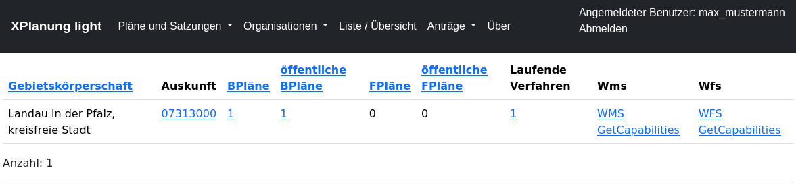
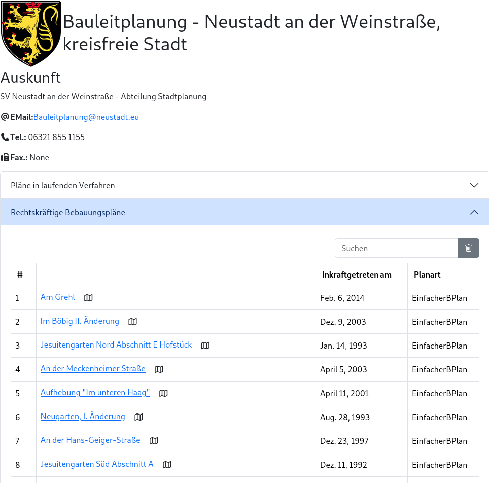
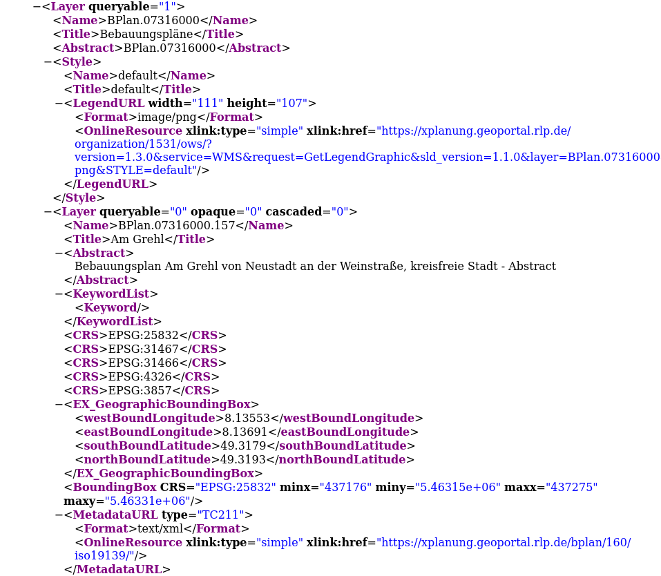
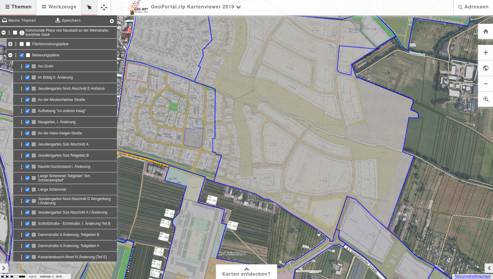
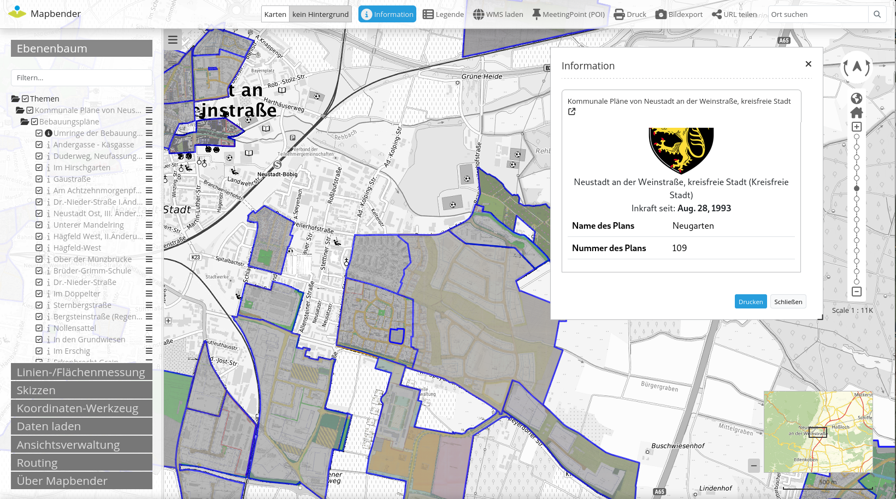
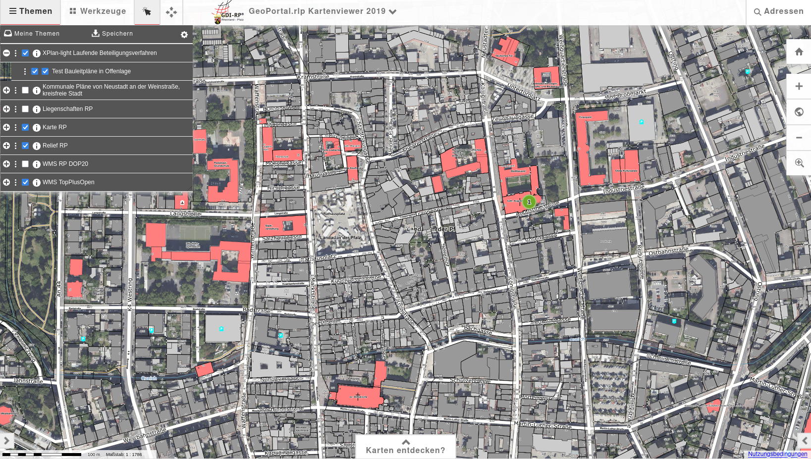

##############
Schnittstellen
##############

Unter **Liste / Übersicht** werden die wichtigsten Informationen für die einzelnen Gebietskörperschaften tabellarisch angezeigt.
Die Spalte **Auskunft** verlinkt auf die automatisch generierte Online-Auskunft für die jeweilieg Gebietskörperschaft.

********
Auskunft
********

(Demo-Daten der Stadt Neustadt a. d. W.)

***************************
WebMapService-Schnittstelle
***************************

============
Capabilities
============

Auszug aus dem Capabilities-Dokument mit Metadaten am jeweiligen Layer (GDI-DE/INSPIRE Vorgabe)

====================
WMS im GeoPortal.rlp
====================

=================
WMS im Mapbender4
=================

Im folgenden Beispiel ist auch die Sachdatenabfrage dargestellt. Hier wird 
bei der Rückgabe der HTML-Seite über die WMS GetFeatureInfo Operation die Detailansicht aus dem Verwaltungssystem genutzt.

*****************************************
OGC Schnittstellen für Pläne im Verfahren
*****************************************

Für die Pläne, die sich in einem Beteiligungsverfahren befinden, gibt es eine eigene WMS/WFS Schnittstelle

